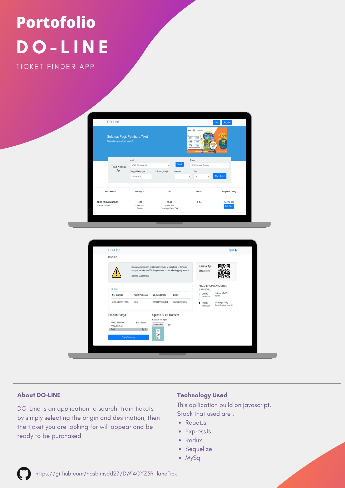

# DO-Line

An Aplication to help ticket seekers find their train ticket easily.

## Table of Contents

- [Getting Started](#getting-started)
  - [Prerequisites](#prerequisites)
  - [Installation](#installation)
  - [Backend Setup](#backend-setup)
  - [Frontend Setup](#frontend-setup)
- [Screenshots](#screenshots)
- [Built With](#built-with)
- [Author](#author)
- [License](#license)

## Getting Started

Before starting to install the project, there're some things that need to be done first.

### Prerequisites

Make sure all of these are properly installed in your system.

| Application  | Download                                                                            |
| ------------ | ----------------------------------------------------------------------------------- |
| Git          | [Windows](https://gitforwindows.org/) / [Linux](https://git-scm.com/download/linux) |
| Node.js      | [Link](https://nodejs.org/en/download/)                                             |
| ReactJS      | [Link](https://reactjs.org/)                                                        |
| MySQL        | [Link](https://www.mysql.com/downloads/)                                            |

### Installation

First, clone this repository into your system.

```
git clone https://github.com/hasbimsdd27/DW14CYZ3R_landTick.git
```

Then, install all the packages that described in `package.json` of both `frontend` and `server` directories.

```
npm install
```

### Backend Setup

For the server setup, first, make sure your MySQL services is running fine. In `backend` directory, you'll find `config.json` inside `config` folder. Open and edit the `development` configuration to match your database setup.

```
  "development": {
    "username": "root",
    "password": null,
    "database": "db_do_line",
    "host": "127.0.0.1",
    "dialect": "mysql",
    "operatorsAliases": false
  },
```

After completing the database configuration setup, migrate all the required tables.

```
npm run build
```

We also need to configure some environtment variables for the backend, let's create `.env` file in backend's root project, open and edit it, then input the code below.

```
SECRET_KEY=ThisIsTheSecretKey
```

The `SECRET_KEY` you can custom it as you wish.

And for the last step, running the backend

```
npm start
```

### Frontend Setup

Before running the application, we need to configure the package environtment variable for the frontend, let's type code below to install all needed package.

```
npm i
```

After needed package successfuly installed then run apllication with typing

`npm start`

Wait till the application appear in your browser and now, you can explore Toon Kingdom and its features. Enjoy!

## Screenshots



## Built With

- [ReactJS](https://reactjs.org/) - Front-end
- [Express JS](https://expressjs.com) - Back-end
- [MySQL](https://www.mysql.com) - Database

## Author

**Hasbi Musaddad** - [hasbimsdd27](https://github.com/hasbimsdd27)

## License

This project is licensed under the GNU General Public v3.0 License - see the [LICENSE](LICENSE) file for details
